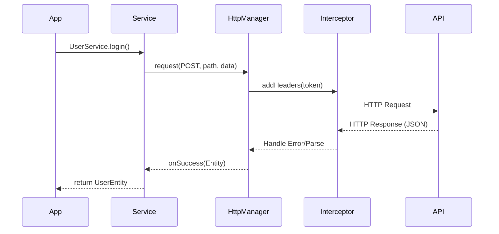

# HTTP Layer Guide

The `kayo_package` networking module provides a structured, type-safe, and interceptor-friendly way to make HTTP requests. It is built to handle common scenarios like authentication, caching, and error parsing out of the box.

## Architecture



## Configuration

### 1. Define your API Environment

Extend `BaseAPI` to manage your environment configurations (Dev/Prod).

```dart
class API extends BaseAPI {
  // Singleton Pattern
  static API get share => API._share();
  static API? _instance;
  API._();
  factory API._share() => _instance ??= API._();

  @override
  String get host => isEnv ? 'https://api.myapp.com/' : 'https://dev-api.myapp.com/';
  
  @override
  bool get isEnv => kReleaseMode; // Automatically switch based on build mode
}
```

### 2. Configure the Manager

Extend `BaseHttpManager` to inject global headers and handle global error codes.

```dart
class HttpManager extends BaseHttpManager {
  static HttpManager get share => _instance ??= HttpManager._();
  static HttpManager? _instance;
  HttpManager._();

  @override
  Future<Map<String, dynamic>> getBaseHeader() async {
    // Automatically attach token to every request
    final token = await AuthService.getToken();
    return {
      'Authorization': 'Bearer $token',
      'Content-Type': 'application/json',
    };
  }

  // Customize Error Messages
  @override
  String textNetworkError() => 'Network connection failed';
  @override
  String textRequestError() => 'Request failed, please try again';
}
```

## Making Requests

Use the `request` method to perform operations. It supports callbacks for success, failure, and caching.

### GET Request

```dart
HttpManager.share.request(
  requestMethod: RequestMethod.GET,
  url: '${API.share.host}users/profile',
  data: {'id': 123}, // Query Parameters
  
  onSuccess: (data) {
    // 'data' is the raw JSON/Map. Parse it into a model.
    final user = UserEntity.fromJson(data);
    print('User: ${user.name}');
  },
  
  onError: (code, message) {
    // 'code': HTTP status or internal error code
    // 'message': User-friendly error string
    LoadingUtils.showError(data: message);
  },
);
```

### POST Request

```dart
HttpManager.share.request(
  requestMethod: RequestMethod.POST,
  url: '${API.share.host}posts/create',
  data: {
    'title': 'New Post',
    'content': 'Hello World'
  },
  onSuccess: (data) => print('Post created!'),
);
```

---

## The Service Pattern

> [!TIP]
> Do not make raw HTTP calls inside your ViewModels. Encapsulate them in **Service** classes.

**Bad:**

```dart
// In ViewModel
HttpManager.share.request(...)
```

**Good:**

```dart
// In UserServices.dart
class UserService {
  Future<User> getUser(int id) {
    // Wrap the callback-based API into a Future if preferred
    final completer = Completer<User>();
    
    HttpManager.share.request(
        url: ...,
        onSuccess: (data) => completer.complete(User.fromJson(data)),
        onError: (code, msg) => completer.completeError(msg),
    );
    
    return completer.future;
  }
}

// In ViewModel
final user = await HttpQuery.share.userService.getUser(1);
```

## Error Handling

Standardize your error handling using `BaseCode`.

| Code | Constant | Meaning |
| :--- | :--- | :--- |
| 0 | `RESULT_OK` | Success |
| -1 | `NETWORK_ERROR` | Connection failed |
| 401 | `SIGN_ERROR` | Unauthorized / Token Expired |

The `BaseHttpManager` automatically broadcasts events for critical errors (like 401).

```dart
// In your main initialization
BaseCode.eventBus.on<BaseHttpErrorEvent>().listen((event) {
  if (event.code == BaseCode.RESULT_ERROR_SIGN_ERROR) {
    // Redirect to login page
    Navigator.of(context).pushNamed('/login');
  }
});
```
